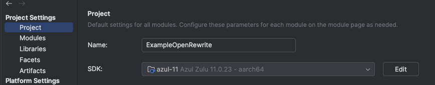

The point of this repo is to demonstrate an issue executing the MigrateObjectsToStringHelperToMoreObjects recipe on
Java 8, vs. Java 11+.

To replicate:

1. Switch out the project JDK (see below for IntelliJ):
   
   1. Change to 1.8 to see the test fail, 11 to see it pass.
2. Run `./gradlew test`
